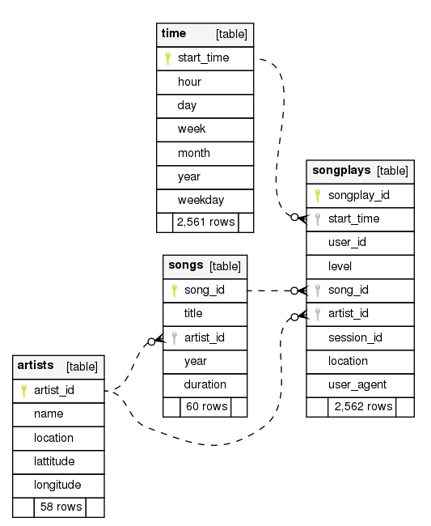
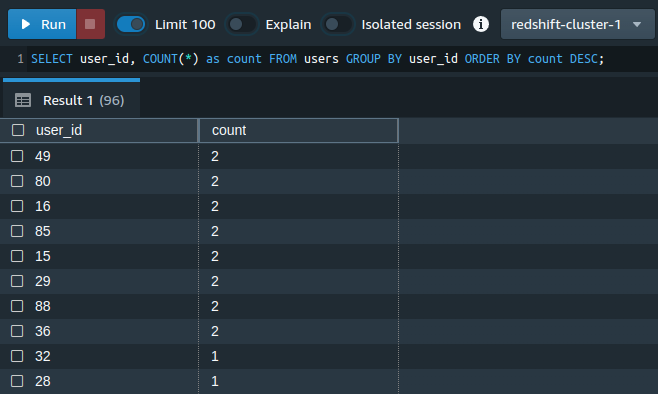
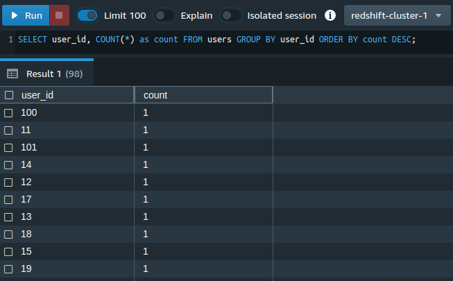

# udacity-data_warehouse
Submission for Udacity's Data Warehouse project.

- [Link to rubric](https://review.udacity.com/#!/rubrics/2501/view)
- [Link to project instructions](https://classroom.udacity.com/nanodegrees/nd027/parts/69a25b76-3ebd-4b72-b7cb-03d82da12844/modules/58ff61b9-a54f-496d-b4c7-fa22750f6c76/lessons/b3ce1791-9545-4187-b1fc-1e29cc81f2b0/concepts/last-viewed?contentVersion=2.0.0&contentLocale=en-us)

**Note:** Before running the scripts, rename `dwh.default.cfg` to `dwh.cfg` and update the config parameters as needed.

## Introduction
The purpose of the database is to make it easier for the data science team at Sparkify to analyze their app's users' behaviors. Searching for particular song play event or a group of them can be done by running SQL queries to the final database.

## Schema Design



List of tables
- staging_events: Staging table for data from `s3://udacity-dend/log_data`
- staging_songs: Staging table for data from `s3://udacity-dend/song_data`
- songplays: Log data of song plays.
- users: Users in the app.
- songs: Songs in the app's music database.
- artists: Artists in the app's music database.
- time: Timestamps of records in songplays.

## How to run the scripts:

```
$ python create_tables.py
```

followed with

```
python etl.py
```

## Explanation of the files in the repository:

1. `check_files.py`: I created this script to check if the files in Udacity's S3 instance existed. To run this code, `ACCESS_KEY` and `ACCESS_SECRET` need to also be set in the config file `dwh.cfg`.
2. `create_tables`: Send commands to Redshift cluster to run table creation queries.
3. `dwh.default.cfg`: Configurations for running all the script files. Rename to `dwh.cfg` before running the scripts.
4. `etl.py`: Send commands to Redshift cluster to copy data from S3 files to staging tables, followed by inserting data from staging to analytical tables.
5. `README.md`: This document.
6. `sql_queries.py`: All queries used throughout this project.

## ETL Pipeline

1. Delete if exists and create all tables listed in the "Schema Design" section above. This is done in `create_tables.py`. The other points below are done in the `etl.py` script.
2. Copy all data from `s3://udacity-dend/song_data` and `s3://udacity-dend/log_data` to staging tables `staging_songs` and `staging_events`, respectively. These staging tables have the exact same structure with the raw json files.
3. Run SQL queries to select data from staging tables and then directly insert them to the other 5 tables (i.e. our OLAP/analytical tables). When running the insert code, handle duplicate records by not inserting values when duplicates are found.

## Additional

I also created a `check_files.py` script


## Note on duplicate users table

Using SELECT DISTINCT does not work:

```
user_table_insert = ("""
    INSERT INTO users (user_id, first_name, last_name, gender, level)
    SELECT DISTINCT userId,
            firstName,
            lastName,
            gender,
            level
    FROM FROM staging_events
    WHERE page = 'NextSong'
    AND userId NOT IN (SELECT DISTINCT user_id FROM users)
""")
```

This query would result in duplicate users in the users table.

I used the following query to test duplicates. When correct. All rows should have the count of 1:



*Note: I only entered the staging data from the path `s3://udacity-dend/song-data/A/A/A` so there are only a couple of duplicate rows, but the existence of rows with count of 2 is enough to prove my point.*

Instead, I used a CTE and rank to make sure there is no duplicate in the users table:

```
user_table_insert = """
    INSERT INTO users(user_id, first_name, last_name, gender, level)
    WITH uniq_staging_events AS (
    	SELECT userId, firstName, lastName, gender, level,
    		   ROW_NUMBER() OVER(PARTITION BY userid ORDER BY ts DESC) AS rank
    	FROM staging_events
                WHERE userId IS NOT NULL AND page = 'NextSong'
    )
    SELECT userId, firstName, lastName, gender, level
    	FROM uniq_staging_events
    WHERE rank = 1
"""
```

and Voila! The result is as expected:



The method shown in [this post in the Knowledge Hub](https://knowledge.udacity.com/questions/42129) also works.
